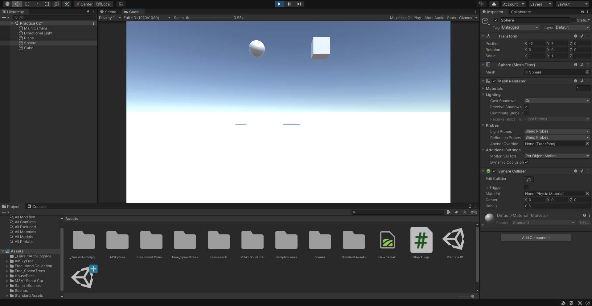
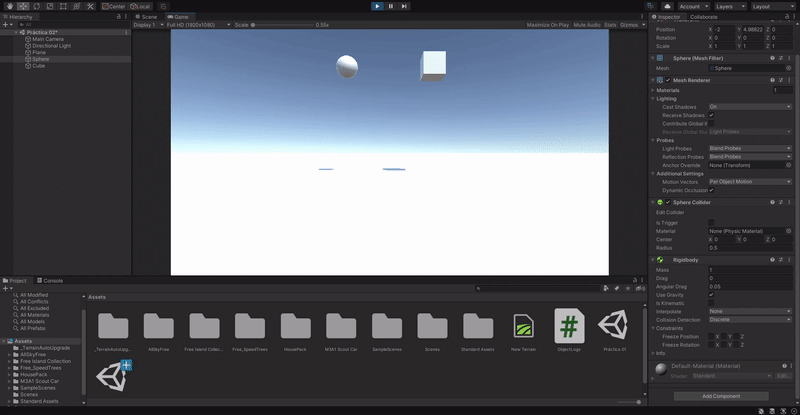
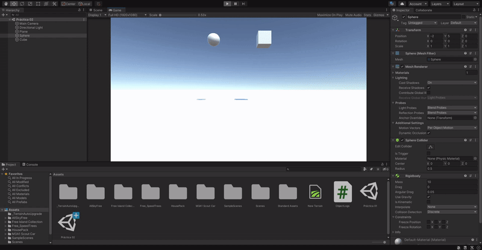
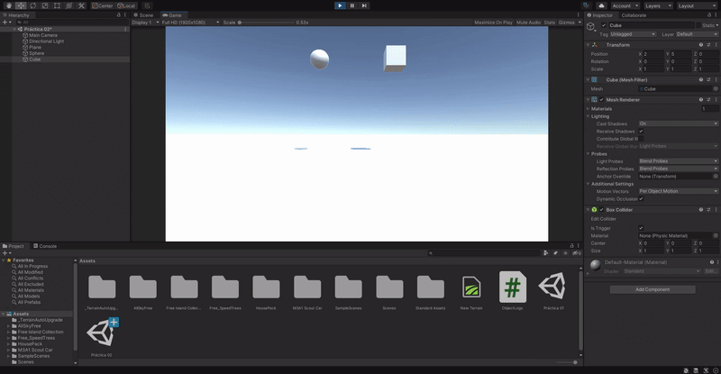

# Práctica 2

1. Crear una escena simple sobre la que probar diferentes configuraciones de objetos físicos en Unity. La escena debe tener un plano a modo de suelo, una esfera y un cubo.
   1. Ninguno de los objetos será físico. \
       \
      Ninguno de los objetos cae.

   2. La esfera tiene físicas, el cubo no. \
       \
      La esfera cae hasta chocar contra el plano, el cubo no.

   3. La esfera y el cubo tienen físicas. \
       \
      Ambos objetos caen hasta chocar contra el plano.

   4. La esfera y el cubo son físicos y la esfera tiene 10 veces la masa del cubo. \
       \
      Ambos objetos caen hasta chocar contra el plano a la vez porque la masa no afecta a la aceleración de la caida.

   5. La esfera tiene físicas y el cubo es de tipo IsTrigger. \
       \
      La esfera cae, el cubo no. No se observan diferencias con el apartado nº 2.

   6. La esfera tiene físicas, el cubo es de tipo IsTrigger y tiene físicas. \
       \
      Ambos objetos caen, la esfera se para al chocar contra el plano pero el cubo lo atraviesa y sigue cayendo.

   7. La esfera y el cubo son físicos y la esfera tiene 10 veces la masa del cubo, se impide la rotación del cubo sobre el plano XZ. \
       \
      Ambos objetos caen. No se observan diferencias con el apartado nº 3.

2. Sobre la escena que has trabajado ubica un cubo que represente un personaje que vas a mover. Se debe implementar un script que haga de CharacterController. Cuando el jugador pulse las teclas de flecha (o wasd) el jugador se moverá en la dirección que estos ejes indican.
   1. Crear un script para el personaje que lo desplace por la pantalla, sin aplicar simulación física. \

   2. Agregar un campo público que permita graduar la velocidad del movimiento desde el inspector de objetos. \

   3. Estar a la escucha de si el usuario ha utilizado los ejes virtuales. Elegir cuáles se va a permitir utilizar: flechas, wasd. \
