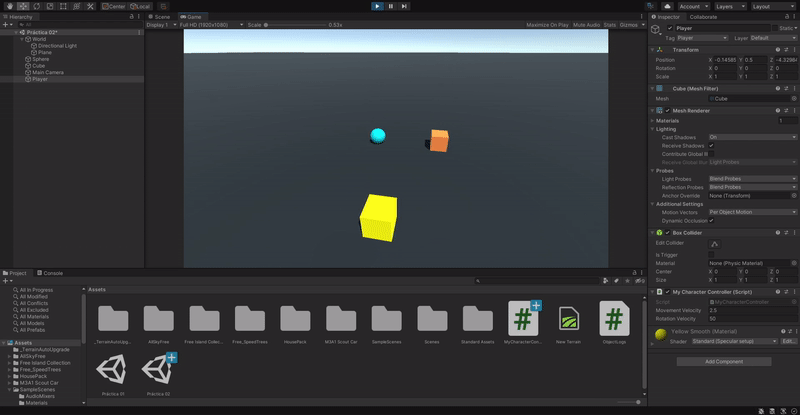
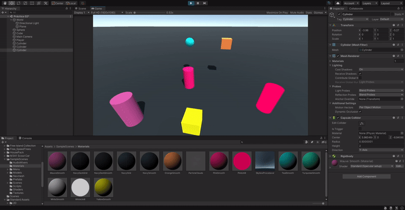

# Práctica 2

1. Crear una escena simple sobre la que probar diferentes configuraciones de objetos físicos en Unity. La escena debe tener un plano a modo de suelo, una esfera y un cubo.
   1. Ninguno de los objetos será físico. \
       \
      Ninguno de los objetos cae.

   2. La esfera tiene físicas, el cubo no. \
       \
      La esfera cae hasta chocar contra el plano, el cubo no.

   3. La esfera y el cubo tienen físicas. \
       \
      Ambos objetos caen hasta chocar contra el plano.

   4. La esfera y el cubo son físicos y la esfera tiene 10 veces la masa del cubo. \
       \
      Ambos objetos caen hasta chocar contra el plano a la vez porque la masa no afecta a la aceleración de la caida.

   5. La esfera tiene físicas y el cubo es de tipo IsTrigger. \
       \
      La esfera cae, el cubo no. No se observan diferencias con el apartado nº 2.

   6. La esfera tiene físicas, el cubo es de tipo IsTrigger y tiene físicas. \
       \
      Ambos objetos caen, la esfera se para al chocar contra el plano pero el cubo lo atraviesa y sigue cayendo.

   7. La esfera y el cubo son físicos y la esfera tiene 10 veces la masa del cubo, se impide la rotación del cubo sobre el plano XZ. \
       \
      Ambos objetos caen. No se observan diferencias con el apartado nº 3.

2. Sobre la escena que has trabajado ubica un cubo que represente un personaje que vas a mover. Se debe implementar un script que haga de CharacterController. Cuando el jugador pulse las teclas de flecha (o wasd) el jugador se moverá en la dirección que estos ejes indican.
   1. Crear un script para el personaje que lo desplace por la pantalla, sin aplicar simulación física.
   2. Agregar un campo público que permita graduar la velocidad del movimiento desde el inspector de objetos.
   3. Estar a la escucha de si el usuario ha utilizado los ejes virtuales. Elegir cuáles se va a permitir utilizar: flechas, wasd.
   4. Elegir otros ejes virtuales para el giro y girar al jugador sobre el eje OY (up).

   ```cs
   public class MyCharacterController : MonoBehaviour {
      public float movementVelocity;
      public float rotationVelocity;

      // Start is called before the first frame update
      void Start() {
         movementVelocity = 2.5f;
         rotationVelocity = 50.0f;
      }

      // Update is called once per frame
      void Update() {
         float xAxis = Input.GetAxis("xAxis");
         float zAxis = Input.GetAxis("zAxis");
         Vector3 moveDirection = new Vector3(xAxis, 0.0f, zAxis);
         this.transform.position += moveDirection * movementVelocity * Time.deltaTime;

         float yAxis = Input.GetAxis("yAxis");
         this.transform.Rotate(0.0f, yAxis * rotationVelocity * Time.deltaTime, 0.0f);
      }
   }
   ```

   

   Con este script obtenemos los datos de las teclas ("wasd" o flechas) que han sido pulsadas y le aplicamos la transformación correspondiente a la posición del personaje. \
   También añadimos un atributo público para almacenar un multiplicador de la velocidad del personaje, que este pueda ser modificado desde el inspector de unity, y lo aplicamos al cálculo de la velocidad. \
   Finalmente, de forma parecida al desplazamiento horizontal, obtenemos los datos de las teclas ("qe" o ",.") y le aplicamos la transformación correspondiente a la rotación del personaje. Al igual que con la posición, la rotación también dispone de un atributo publico para modificar la velocidad.

3. Sobre la escena que has trabajado programa los scripts necesarios para las siguientes acciones:
   1. Se deben incluir varios cilindros sobre la escena. Cada vez que el objeto jugador colisione con alguno de ellos, deben aumentar su tamaño y el jugador aumentar puntuación.

      ```cs
      public class MyCharacterController : MonoBehaviour {
         public int score;
         // ...
         void Start() {
            score = 0;
            // ...
         }
         // ...
         void OnCollisionEnter(Collision other) {
            if (other.gameObject.name == "Cylinder") {
               score++;
               other.transform.localScale *= 1.2f;
            }
         }
      }
      ```

      

   2. Agregar cilindros de tipo A, en los que además, si el jugador pulsa la barra espaciadora lo mueve hacia fuera de él.

      ```cs
      public class MyCharacterController : MonoBehaviour {
         float minCylinderDistance;
         // ...
         void Start() {
            minCylinderDistance = 3f;
            //...
         }
         //...
         void Update() {
            //...
            if (Input.GetKey(KeyCode.Space)) {
               GameObject[] tipeACylinder = GameObject.FindGameObjectsWithTag("Type A Cylinder");
               foreach (GameObject cylinder in tipeACylinder) {
                  float cylinderDistance = Vector3.Distance(cylinder.transform.position, this.transform.position);
                  if (cylinderDistance < minCylinderDistance) {
                     Vector3 direction = cylinder.transform.position - this.transform.position;
                     cylinder.transform.Translate(direction * Time.deltaTime);
                  }
               }
            }
         }
         // ...
      }
      ```

      

   3. Se deben incluir cilindros que se alejen del jugador cuando esté próximo.

      ```cs
      public class MyCharacterController : MonoBehaviour {
         float minCylinderDistance;
         // ...
         void Start() {
            minCylinderDistance = 3f;
            //...
         }
         //...
         void Update() {
            //...
            GameObject[] tipeBCylinder = GameObject.FindGameObjectsWithTag("Type B Cylinder");
            foreach (GameObject cylinder in tipeBCylinder) {
               float cylinderDistance = Vector3.Distance(cylinder.transform.position, this.transform.position);
               if (cylinderDistance < minCylinderDistance) {
                  Vector3 direction = cylinder.transform.position - this.transform.position;
                  cylinder.transform.Translate(direction * Time.deltaTime);
               }
            }
         }
         // ...
      }
      ```

      
